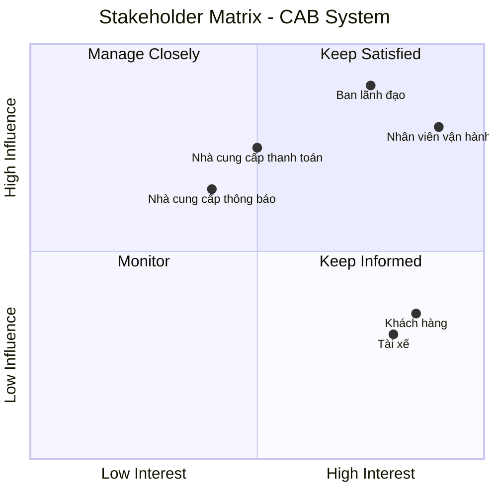

# Software Requirements Specification (SRS)

## 1. Business Analysis

### 1.1. Business Context

#### 1.1.1. Bối cảnh doanh nghiệp

Công ty ABC là doanh nghiệp cung cấp dịch vụ đặt xe trực tuyến. Hiện tại,
khách hàng có thể yêu cầu xe thông qua tổng đài hoặc một ứng dụng đơn giản.

Tuy nhiên, hệ thống hiện tại còn nhiều hạn chế:

- Việc phân công tài xế chủ yếu được thực hiện thủ công.
- Khách hàng khó theo dõi trạng thái chuyến đi.
- Thông tin thanh toán chưa được quản lý tập trung.
- Bộ phận vận hành gặp khó khăn khi muốn mở rộng hệ thống.

Ban lãnh đạo mong muốn xây dựng một nền tảng CAB mới có khả năng phục vụ
số lượng lớn khách hàng và tài xế, đồng thời có thể phát triển thêm các
tính năng trong tương lai.

### 1.2. Business Problem

#### 1.2.1. Vấn đề kinh doanh cốt lõi

Công ty ABC đang gặp khó khăn trong việc quản lý và mở rộng dịch vụ đặt xe
do quy trình phân công tài xế còn phụ thuộc nhiều vào xử lý thủ công,
khả năng theo dõi chuyến và quản lý thanh toán còn hạn chế, hoạt động vận hành
chưa được tập trung và hệ thống hiện tại thiếu khả năng mở rộng linh hoạt.

Điều này ảnh hưởng đến:

- Trải nghiệm của khách hàng.
- Hiệu quả vận hành.
- Khả năng kiểm soát hoạt động.
- Khả năng mở rộng quy mô dịch vụ.
- Khả năng phát triển các tính năng mới trong tương lai.

#### 1.2.2. Các vấn đề cụ thể

| # | Business Problem | Tác động |
|---|---|---|
| 1 | Phân công tài xế chủ yếu thủ công | Khó mở rộng và giảm hiệu quả vận hành |
| 2 | Khách hàng khó theo dõi chuyến đi | Trải nghiệm khách hàng không minh bạch |
| 3 | Thanh toán chưa được quản lý tập trung | Khó kiểm soát giao dịch |
| 4 | Khó mở rộng hệ thống | Hạn chế khả năng tăng quy mô dịch vụ |
| 5 | Vận hành khó theo dõi và xử lý sự cố | Tăng khó khăn trong quản lý |
| 6 | Hệ thống thông báo thiếu tính linh hoạt | Khó mở rộng thêm các kênh thông báo |
| 7 | Thiếu dữ liệu quản trị đầy đủ | Khó đánh giá hiệu quả kinh doanh |

### 1.3. As-Is vs To-Be

| As-Is (Hiện tại) | To-Be (Mong muốn) |
|---|---|
| Phân công tài xế chủ yếu thủ công | Tự động tìm và ưu tiên tài xế phù hợp |
| Khó theo dõi trạng thái chuyến | Khách hàng theo dõi được trạng thái chuyến |
| Thanh toán chưa tập trung | Quản lý quy trình thanh toán tập trung |
| Vận hành khó kiểm soát | Có giao diện quản trị tập trung |
| Khó mở rộng hệ thống | Các thành phần có thể mở rộng độc lập |
| Thông báo chưa linh hoạt | Có khả năng mở rộng nhiều kênh thông báo |
| Dữ liệu quản trị chưa đầy đủ | Có báo cáo phục vụ quản trị |

### 1.4. Business Objectives

Các mục tiêu kinh doanh được xác định từ yêu cầu của khách hàng:

- Xây dựng nền tảng đặt xe có khả năng phục vụ số lượng lớn khách hàng và
  tài xế.
- Số hóa quy trình từ đặt xe đến hoàn thành chuyến.
- Tự động hóa việc tìm và phân công tài xế.
- Cải thiện khả năng theo dõi chuyến đi.
- Quản lý tập trung thông tin chuyến đi và thanh toán.
- Hỗ trợ nhân viên vận hành quản lý và xử lý sự cố.
- Cung cấp dữ liệu và báo cáo cho ban lãnh đạo.
- Đảm bảo kiến trúc đủ linh hoạt để phát triển các dịch vụ và tính năng mới.

## 2. Stakeholder Analysis

### 2.1. Stakeholder

| Stakeholder | Vai trò |
|---|---|
| **Khách hàng** | Đăng ký tài khoản, đăng nhập, cập nhật thông tin cá nhân, đặt xe, theo dõi chuyến đi, xem lịch sử chuyến, thanh toán và đánh giá tài xế. |
| **Tài xế** | Đăng ký hoặc được tạo tài khoản, quản lý hồ sơ và phương tiện, cập nhật trạng thái hoạt động, nhận/từ chối chuyến và cập nhật trạng thái chuyến đi. |
| **Nhân viên vận hành** | Quản lý khách hàng, tài xế, phương tiện và chuyến đi; theo dõi các chuyến đang diễn ra, trạng thái tài xế, xử lý sự cố và tra cứu lịch sử giao dịch. |
| **Ban lãnh đạo** | Theo dõi và sử dụng các báo cáo về số lượng chuyến, doanh thu, tỷ lệ hoàn thành, tỷ lệ hủy và hiệu quả hoạt động của tài xế. |
| **Nhà cung cấp thanh toán** | Cung cấp dịch vụ thanh toán điện tử bên ngoài cho hệ thống CAB. |
| **Nhà cung cấp thông báo** | Cung cấp các kênh thông báo cho khách hàng và tài xế, đồng thời có khả năng mở rộng thêm các kênh trong tương lai. |

### 2.2. Stakeholder Matrix

Ma trận stakeholder được xây dựng dựa trên hai tiêu chí:

- **Influence:** Mức độ ảnh hưởng hoặc quyền quyết định đối với hệ thống.
- **Interest:** Mức độ quan tâm và mức độ liên quan của stakeholder đối với hệ thống.


## 3. Business Goals

Business Goals (BG) được xác định dựa trên các vấn đề kinh doanh và kỳ vọng
của Công ty ABC. Mỗi Business Goal mô tả một kết quả mà doanh nghiệp mong
muốn đạt được, trong khi hệ thống sẽ cung cấp các chức năng và khả năng cần
thiết để hỗ trợ đạt được mục tiêu đó.

### 3.1. Danh sách Business Goals

| ID | Business Goal | Mục đích / System Support |
|---|---|---|
| **BG01** | **Giảm thời gian tìm và phân công tài xế** | Hệ thống tự động xác định và ưu tiên tài xế phù hợp dựa trên vị trí, trạng thái sẵn sàng và các tiêu chí vận hành. |
| **BG02** | **Hỗ trợ và quản lý thanh toán** | Cho phép khách hàng thanh toán bằng tiền mặt hoặc phương thức điện tử; tích hợp với nhà cung cấp thanh toán bên ngoài và không lưu thông tin thanh toán nhạy cảm trực tiếp trong hệ thống CAB. |
| **BG03** | **Cải thiện khả năng theo dõi chuyến đi** | Cho phép khách hàng biết trạng thái yêu cầu, tài xế đã nhận chuyến, thời gian dự kiến tài xế đến và trạng thái hiện tại của chuyến đi. |
| **BG04** | **Nâng cao hiệu quả vận hành** | Cung cấp giao diện quản trị để nhân viên vận hành quản lý khách hàng, tài xế, phương tiện và chuyến đi; theo dõi chuyến đang diễn ra và xử lý các trường hợp chuyến bị lỗi. |
| **BG05** | **Cải thiện khả năng giao tiếp và thông báo** | Gửi thông báo cho khách hàng và tài xế tại các thời điểm quan trọng trong vòng đời chuyến đi và cho phép mở rộng thêm các kênh thông báo trong tương lai. |
| **BG06** | **Nâng cao khả năng quản trị và ra quyết định** | Cung cấp dữ liệu và báo cáo về số lượng chuyến, doanh thu, tỷ lệ chuyến hoàn thành, tỷ lệ hủy và hiệu quả hoạt động của tài xế. |
| **BG07** | **Đảm bảo khả năng mở rộng của hệ thống** | Cho phép các thành phần của hệ thống mở rộng độc lập khi tải tăng và cho phép triển khai chức năng mới từng phần mà hạn chế ảnh hưởng đến các chức năng đang hoạt động. |
| **BG08** | **Đảm bảo tính bảo mật và khả năng kiểm soát hệ thống** | Xác thực người dùng, kiểm soát quyền truy cập các chức năng quản trị, bảo vệ dữ liệu cá nhân, dữ liệu phương tiện, vị trí và giao dịch; lưu vết các thao tác quan trọng. |
| **BG09** | **Nâng cao trải nghiệm khách hàng sau chuyến đi** | Cho phép khách hàng xem lịch sử chuyến đi, số tiền phải trả và đánh giá tài xế sau khi chuyến hoàn thành. |
| **BG10** | **Tăng khả năng phát triển dịch vụ trong tương lai** | Xây dựng nền tảng đủ linh hoạt để bổ sung loại dịch vụ, phương thức thanh toán, nhà cung cấp thông báo hoặc thay đổi thành phần kỹ thuật mà không phải xây dựng lại toàn bộ ứng dụng. |

### 3.2. Chi tiết Business Goals

#### BG01 — Giảm thời gian tìm và phân công tài xế

**Business Goal:**

Giảm thời gian cần thiết để tìm và phân công tài xế phù hợp cho một yêu cầu
đặt xe.

**System Support:**

- Tự động xác định các tài xế phù hợp.
- Ưu tiên tài xế gần khách hàng.
- Xem xét trạng thái sẵn sàng của tài xế.
- Xem xét các tiêu chí vận hành khác.
- Tự động tiếp tục tìm tài xế khác khi tài xế được đề xuất không phản hồi
  hoặc từ chối.
- Thông báo cho khách hàng khi không tìm được tài xế.

---

#### BG02 — Hỗ trợ và quản lý thanh toán

**Business Goal:**

Đảm bảo khách hàng có thể thanh toán chuyến đi bằng các phương thức phù hợp
và doanh nghiệp có thể quản lý kết quả thanh toán.

**System Support:**

- Tính số tiền khách hàng phải trả sau khi chuyến hoàn thành.
- Hỗ trợ thanh toán bằng tiền mặt.
- Hỗ trợ thanh toán điện tử.
- Tích hợp với nhà cung cấp thanh toán bên ngoài.
- Không lưu trực tiếp thông tin nhạy cảm của thẻ hoặc tài khoản thanh toán.
- Thông báo kết quả thanh toán cho khách hàng.
- Cho phép xử lý lại khi thanh toán điện tử thất bại theo chính sách doanh nghiệp.

---

#### BG03 — Cải thiện khả năng theo dõi chuyến đi

**Business Goal:**

Tăng tính minh bạch của quá trình đặt và thực hiện chuyến đối với khách hàng.

**System Support:**

- Hiển thị trạng thái đang tìm tài xế.
- Hiển thị tài xế đã nhận chuyến.
- Hiển thị thời gian dự kiến tài xế đến.
- Theo dõi trạng thái hiện tại của chuyến.
- Thông báo các thay đổi quan trọng trong quá trình thực hiện chuyến.

---

#### BG04 — Nâng cao hiệu quả vận hành

**Business Goal:**

Giúp nhân viên vận hành có khả năng theo dõi, quản lý và xử lý hoạt động
đặt xe từ một hệ thống tập trung.

**System Support:**

- Quản lý khách hàng.
- Quản lý tài xế.
- Quản lý phương tiện.
- Quản lý chuyến đi.
- Theo dõi các chuyến đang diễn ra.
- Kiểm tra trạng thái tài xế.
- Xử lý các trường hợp chuyến bị lỗi.
- Tra cứu lịch sử giao dịch.
- Phân quyền các chức năng quản trị.

---

#### BG05 — Cải thiện khả năng giao tiếp và thông báo

**Business Goal:**

Đảm bảo khách hàng và tài xế nhận được thông tin kịp thời trong quá trình
đặt và thực hiện chuyến.

**System Support:**

- Thông báo khi yêu cầu đặt xe được tiếp nhận.
- Thông báo khi tài xế nhận chuyến.
- Thông báo khi tài xế đến điểm đón.
- Thông báo khi chuyến hoàn thành.
- Thông báo kết quả thanh toán.
- Thông báo cho tài xế về chuyến mới hoặc thay đổi liên quan đến chuyến đang
  thực hiện.
- Hỗ trợ mở rộng thêm các kênh thông báo trong tương lai.

---

#### BG06 — Nâng cao khả năng quản trị và ra quyết định

**Business Goal:**

Cung cấp dữ liệu cần thiết để ban lãnh đạo theo dõi và đánh giá hiệu quả
kinh doanh và vận hành.

**System Support:**

- Báo cáo số lượng chuyến.
- Báo cáo doanh thu.
- Báo cáo tỷ lệ chuyến hoàn thành.
- Báo cáo tỷ lệ hủy.
- Báo cáo hiệu quả hoạt động của tài xế.

---

#### BG07 — Đảm bảo khả năng mở rộng của hệ thống

**Business Goal:**

Đảm bảo hệ thống có thể tiếp tục hoạt động khi số lượng khách hàng, tài xế
và tải hệ thống tăng lên.

**System Support:**

- Cho phép các thành phần mở rộng độc lập khi tải tăng.
- Hạn chế việc một lỗi tại thanh toán hoặc thông báo làm toàn bộ hệ thống
  đặt xe ngừng hoạt động.
- Cho phép triển khai chức năng mới từng phần.
- Hạn chế ảnh hưởng của chức năng mới đến các chức năng đang hoạt động.

---

#### BG08 — Đảm bảo tính bảo mật và khả năng kiểm soát hệ thống

**Business Goal:**

Bảo vệ dữ liệu và đảm bảo các thao tác trong hệ thống được thực hiện bởi
đúng đối tượng có quyền.

**System Support:**

- Xác thực khách hàng và tài xế trước khi sử dụng chức năng yêu cầu tài khoản.
- Kiểm soát quyền truy cập các chức năng quản trị.
- Bảo vệ thông tin cá nhân.
- Bảo vệ thông tin phương tiện.
- Bảo vệ dữ liệu vị trí.
- Bảo vệ dữ liệu giao dịch.
- Lưu vết các thao tác quan trọng để phục vụ kiểm tra khi có sự cố.

---

#### BG09 — Nâng cao trải nghiệm khách hàng sau chuyến đi

**Business Goal:**

Cải thiện trải nghiệm khách hàng sau khi hoàn thành chuyến và tạo cơ sở để
doanh nghiệp thu thập phản hồi về chất lượng tài xế.

**System Support:**

- Cho phép xem lịch sử chuyến đi.
- Cho phép xem số tiền phải trả.
- Cho phép đánh giá tài xế sau khi chuyến hoàn thành.

---

#### BG10 — Tăng khả năng phát triển dịch vụ trong tương lai

**Business Goal:**

Xây dựng nền tảng CAB có khả năng phát triển lâu dài mà không phải xây dựng
lại toàn bộ hệ thống khi có nhu cầu kinh doanh mới.

**System Support:**

- Có khả năng bổ sung loại dịch vụ mới.
- Có khả năng bổ sung phương thức thanh toán mới.
- Có khả năng bổ sung nhà cung cấp thông báo mới.
- Có khả năng thay đổi một số thành phần kỹ thuật.
- Hạn chế ảnh hưởng đến các thành phần đang hoạt động khi mở rộng hệ thống.

### 3.3. Business Goal Summary

| ID | Business Goal | Priority |
|---|---|---|
| **BG01** | Giảm thời gian tìm và phân công tài xế | High |
| **BG02** | Hỗ trợ và quản lý thanh toán | High |
| **BG03** | Cải thiện khả năng theo dõi chuyến đi | High |
| **BG04** | Nâng cao hiệu quả vận hành | High |
| **BG05** | Cải thiện khả năng giao tiếp và thông báo | High |
| **BG06** | Nâng cao khả năng quản trị và ra quyết định | Medium |
| **BG07** | Đảm bảo khả năng mở rộng của hệ thống | High |
| **BG08** | Đảm bảo tính bảo mật và khả năng kiểm soát hệ thống | High |
| **BG09** | Nâng cao trải nghiệm khách hàng sau chuyến đi | Medium |
| **BG10** | Tăng khả năng phát triển dịch vụ trong tương lai | High |

> **Note:** Priority là đánh giá ban đầu dựa trên mức độ quan trọng thể hiện
> trong yêu cầu khách hàng. Tài liệu chưa cung cấp thứ tự ưu tiên chính thức
> từ phía doanh nghiệp, vì vậy cần xác nhận lại với stakeholder trong các bước
> phân tích tiếp theo.

## 4. Scope

### 4.1. Scope Definition

Phạm vi của CAB System tập trung vào việc xây dựng một nền tảng đặt xe trực tuyến
hỗ trợ toàn bộ quy trình nghiệp vụ chính:

**Đặt xe → Tìm tài xế → Phân công tài xế → Thực hiện chuyến → Tính cước →
Thanh toán → Thông báo → Đánh giá → Quản trị và báo cáo**

Phạm vi được xác định dựa trên yêu cầu của khách hàng và thời gian xây dựng,
triển khai sản phẩm dự kiến là **7 tuần**.

---

### 4.2. In Scope

Các chức năng sau nằm trong phạm vi xây dựng của hệ thống CAB:

#### 4.2.1. Quản lý khách hàng

- Đăng ký tài khoản.
- Đăng nhập.
- Cập nhật thông tin cá nhân.
- Nhập điểm đón và điểm đến.
- Lựa chọn loại xe.
- Gửi yêu cầu đặt xe.
- Theo dõi trạng thái chuyến đi.
- Xem lịch sử chuyến đi.
- Xem số tiền phải trả.
- Đánh giá tài xế sau khi hoàn thành chuyến.

#### 4.2.2. Quản lý tài xế

- Đăng ký tài khoản hoặc được nhân viên vận hành tạo tài khoản.
- Cập nhật hồ sơ tài xế.
- Quản lý thông tin phương tiện.
- Cập nhật trạng thái hoạt động.
- Chuyển sang trạng thái sẵn sàng nhận chuyến.
- Nhận thông báo về chuyến mới.
- Chấp nhận hoặc từ chối chuyến.
- Cập nhật trạng thái chuyến:
  - Đã đến điểm đón.
  - Đã đón khách.
  - Đang di chuyển.
  - Hoàn thành chuyến.
- Lưu thông tin vị trí của tài xế.

#### 4.2.3. Quản lý đặt xe và phân công tài xế

- Tiếp nhận yêu cầu đặt xe.
- Xác định tài xế phù hợp.
- Xem xét vị trí của tài xế.
- Xem xét trạng thái sẵn sàng của tài xế.
- Áp dụng các tiêu chí vận hành để lựa chọn tài xế.
- Ưu tiên tài xế phù hợp và gần khách hàng.
- Gửi yêu cầu đến tài xế.
- Xử lý trường hợp tài xế không phản hồi.
- Xử lý trường hợp tài xế từ chối.
- Tiếp tục tìm tài xế khác mà không yêu cầu khách hàng tạo lại yêu cầu.
- Thông báo cho khách hàng khi không tìm được tài xế.

#### 4.2.4. Quản lý chuyến đi

- Quản lý vòng đời của chuyến đi.
- Cập nhật trạng thái chuyến.
- Theo dõi chuyến đang diễn ra.
- Lưu thông tin chuyến đi.
- Liên kết khách hàng, tài xế và phương tiện với chuyến đi.
- Lưu lịch sử chuyến đi.

#### 4.2.5. Tính cước

- Xác định số tiền khách hàng phải trả sau khi chuyến hoàn thành.
- Tính cước dựa trên loại dịch vụ và thông tin chuyến đi.

> **Note:** Chi tiết công thức tính cước chưa được khách hàng chốt và phải
> được BA làm rõ trước khi triển khai.

#### 4.2.6. Thanh toán

- Hỗ trợ thanh toán bằng tiền mặt.
- Hỗ trợ thanh toán điện tử.
- Tích hợp với nhà cung cấp thanh toán bên ngoài.
- Không lưu trực tiếp thông tin nhạy cảm của thẻ hoặc tài khoản thanh toán.
- Ghi nhận kết quả giao dịch.
- Thông báo kết quả thanh toán.
- Xử lý lại giao dịch thanh toán điện tử thất bại theo chính sách doanh nghiệp.

#### 4.2.7. Thông báo

- Thông báo khi yêu cầu đặt xe được tiếp nhận.
- Thông báo khi tài xế nhận chuyến.
- Thông báo khi tài xế đến điểm đón.
- Thông báo khi chuyến hoàn thành.
- Thông báo kết quả thanh toán.
- Thông báo cho tài xế về chuyến mới.
- Thông báo cho tài xế về thay đổi liên quan đến chuyến đang thực hiện.
- Thiết kế khả năng mở rộng thêm các kênh thông báo trong tương lai.

#### 4.2.8. Quản trị và vận hành

- Quản lý khách hàng.
- Quản lý tài xế.
- Quản lý phương tiện.
- Quản lý chuyến đi.
- Theo dõi các chuyến đang diễn ra.
- Kiểm tra trạng thái tài xế.
- Xử lý các trường hợp chuyến bị lỗi.
- Tra cứu lịch sử giao dịch.
- Phân quyền các chức năng quản trị.

#### 4.2.9. Báo cáo

Hệ thống cần hỗ trợ báo cáo:

- Số lượng chuyến.
- Doanh thu.
- Tỷ lệ chuyến hoàn thành.
- Tỷ lệ hủy.
- Hiệu quả hoạt động của tài xế.

#### 4.2.10. Bảo mật và kiểm soát truy cập

- Xác thực khách hàng và tài xế.
- Kiểm soát quyền truy cập chức năng quản trị.
- Bảo vệ thông tin cá nhân.
- Bảo vệ thông tin phương tiện.
- Bảo vệ dữ liệu vị trí.
- Bảo vệ dữ liệu giao dịch.
- Lưu vết các thao tác quan trọng.

---

### 4.3. Out of Scope

Các nội dung sau **không nên tự đưa vào phạm vi triển khai hiện tại** vì
tài liệu khách hàng chưa yêu cầu hoặc chưa cung cấp đủ thông tin để xác định
yêu cầu cụ thể:

- Tự phát triển hệ thống thanh toán riêng thay cho nhà cung cấp bên ngoài.
- Lưu trữ trực tiếp thông tin thẻ hoặc thông tin tài khoản thanh toán nhạy cảm.
- Tự xây dựng hệ thống cung cấp dịch vụ thông báo thay cho các nhà cung cấp
  bên ngoài.
- Tự xác định công thức tính cước khi khách hàng chưa chốt quy tắc.
- Tự xác định tiêu chí ưu tiên tài xế khi chưa được khách hàng xác nhận.
- Tự xác định thời gian tài xế phải phản hồi.
- Tự xác định chính sách hủy chuyến.
- Tự quyết định thời gian lưu trữ dữ liệu.
- Tự quyết định cách xử lý mất kết nối mạng khi chưa có chính sách nghiệp vụ.
- Các loại dịch vụ mới chưa được yêu cầu trong giai đoạn hiện tại.
- Các phương thức thanh toán mới chưa được xác định.
- Các kênh thông báo mới chưa được xác định cụ thể.
- Các thành phần kỹ thuật mới không phục vụ trực tiếp phạm vi CAB hiện tại.

> **Important:** Out of Scope ở đây không có nghĩa là các chức năng trên sẽ
> không bao giờ được xây dựng. Một số nội dung được đưa vào **Future Scope**
> hoặc **Open Questions** thay vì loại bỏ vĩnh viễn.

---

### 4.4. Future Scope

Các khả năng được khách hàng định hướng cho tương lai:

- Bổ sung các loại dịch vụ mới.
- Bổ sung phương thức thanh toán mới.
- Bổ sung nhà cung cấp thông báo.
- Thay đổi các thành phần kỹ thuật.
- Mở rộng hệ thống khi số lượng khách hàng và tài xế tăng.
- Triển khai thêm các chức năng mà không ảnh hưởng lớn đến hệ thống hiện tại.

Mục tiêu của kiến trúc hiện tại là tạo nền tảng đủ linh hoạt để các khả năng
trên có thể được bổ sung mà không cần xây dựng lại toàn bộ ứng dụng.

---

### 4.5. Module của hệ thống

Dựa trên phạm vi nghiệp vụ, hệ thống CAB có thể được chia thành các module
cơ bản sau:

| Module | Nội dung chính | Phạm vi |
|---|---|---|
| **M01 - Customer Management** | Tài khoản, thông tin cá nhân, lịch sử chuyến, đánh giá | In Scope |
| **M02 - Driver Management** | Hồ sơ tài xế, phương tiện, trạng thái hoạt động | In Scope |
| **M03 - Booking Management** | Tạo và quản lý yêu cầu đặt xe | In Scope |
| **M04 - Driver Matching** | Tìm kiếm và phân công tài xế | In Scope |
| **M05 - Trip Management** | Quản lý trạng thái và vòng đời chuyến | In Scope |
| **M06 - Fare Management** | Tính cước chuyến đi | In Scope |
| **M07 - Payment Management** | Thanh toán tiền mặt và điện tử | In Scope |
| **M08 - Notification** | Gửi thông báo cho khách hàng và tài xế | In Scope |
| **M09 - Operation/Admin** | Quản trị và hỗ trợ vận hành | In Scope |
| **M10 - Reporting** | Báo cáo hoạt động và kinh doanh | In Scope |
| **M11 - Authentication & Authorization** | Xác thực và phân quyền | In Scope |
| **M12 - Audit & Logging** | Lưu vết thao tác quan trọng | In Scope |
| **M13 - External Payment Integration** | Tích hợp nhà cung cấp thanh toán | In Scope |
| **M14 - Notification Provider Integration** | Tích hợp nhà cung cấp thông báo | In Scope |

---

### 4.6. MBB Scope Prioritization

Để kiểm soát phạm vi trong thời gian triển khai **7 tuần**, các hạng mục được
phân loại thành:

- **Must Build (MB):** Bắt buộc phải có để hệ thống đáp ứng quy trình nghiệp vụ
  cốt lõi.
- **Better Build (BB):** Nên xây dựng nếu nguồn lực và thời gian cho phép.
- **Beyond Build (B):** Không triển khai trong giai đoạn hiện tại, có thể xem
  xét trong tương lai.

| ID | Module / Requirement | MBB | Lý do |
|---|---|---|---|
| **M01** | Customer Management | **MB** | Khách hàng là người tạo và sử dụng yêu cầu đặt xe. |
| **M02** | Driver Management | **MB** | Cần quản lý tài xế để thực hiện và phân công chuyến. |
| **M03** | Booking Management | **MB** | Là điểm bắt đầu của toàn bộ quy trình đặt xe. |
| **M04** | Driver Matching | **MB** | Là chức năng nghiệp vụ cốt lõi và giải quyết trực tiếp vấn đề phân công thủ công. |
| **M05** | Trip Management | **MB** | Cần quản lý vòng đời chuyến từ nhận chuyến đến hoàn thành. |
| **M06** | Fare Management | **MB** | Cần xác định số tiền khách hàng phải trả sau chuyến. |
| **M07** | Payment Management | **MB** | Thanh toán là một phần của quy trình nghiệp vụ cốt lõi. |
| **M08** | Notification | **MB** | Khách hàng và tài xế cần nhận thông báo trong các trạng thái quan trọng. |
| **M09** | Operation/Admin | **MB** | Nhân viên vận hành cần quản lý và xử lý các tình huống trong hệ thống. |
| **M10** | Reporting | **BB** | Quan trọng cho quản trị nhưng không trực tiếp tạo ra quy trình đặt xe. |
| **M11** | Authentication & Authorization | **MB** | Là yêu cầu bắt buộc về xác thực và kiểm soát quyền truy cập. |
| **M12** | Audit & Logging | **MB** | Yêu cầu lưu vết các thao tác quan trọng để kiểm tra sự cố. |
| **M13** | Payment Provider Integration | **MB** | Cần thiết để hỗ trợ thanh toán điện tử theo yêu cầu. |
| **M14** | Notification Provider Integration | **MB** | Cần thiết để triển khai cơ chế thông báo. |
| **M15** | Dịch vụ/loại xe mới | **B** | Chưa được yêu cầu cụ thể trong giai đoạn hiện tại. |
| **M16** | Phương thức thanh toán mới | **B** | Khách hàng chỉ yêu cầu tiền mặt và thanh toán điện tử hiện tại. |
| **M17** | Nhà cung cấp thông báo mới | **B** | Là khả năng mở rộng trong tương lai. |
| **M18** | Các thay đổi kỹ thuật không phục vụ yêu cầu hiện tại | **B** | Không thuộc nhu cầu nghiệp vụ của giai đoạn hiện tại. |

---

### 4.7. Scope Boundary

Phạm vi hệ thống CAB trong giai đoạn hiện tại được giới hạn như sau:

```text
                    CAB SYSTEM
                         │
        ┌────────────────┼────────────────┐
        │                │                │
    CUSTOMER          DRIVER          OPERATION
        │                │                │
        └────────────────┼────────────────┘
                         │
                    BOOKING
                         │
                  DRIVER MATCHING
                         │
                       TRIP
                         │
                 ┌───────┴───────┐
                 │               │
              FARE           NOTIFICATION
                 │
              PAYMENT
                 │
          EXTERNAL PROVIDER
```
##Cần xác thực lại với khách hàng các yêu cầu trên để chuyển sang bước tiếp theo

## 5. Business Requirements

Business Requirements (BR) mô tả các nhu cầu nghiệp vụ mà hệ thống CAB cần
đáp ứng để giải quyết Business Problem và đạt được các Business Goals đã
xác định.

### 5.1. Danh sách Business Requirements

| Mã BR | Tên Business Requirement | Diễn giải |
|---|---|---|
| **BR01** | **Đặt chuyến xe** | Hệ thống phải hỗ trợ khách hàng tạo yêu cầu đặt xe bằng cách nhập điểm đón, điểm đến và lựa chọn loại xe. |
| **BR02** | **Tìm và phân công tài xế** | Hệ thống phải tự động xác định và phân công tài xế phù hợp dựa trên vị trí, trạng thái sẵn sàng và các tiêu chí vận hành. |
| **BR03** | **Xử lý từ chối hoặc không phản hồi của tài xế** | Hệ thống phải tiếp tục tìm tài xế khác khi tài xế được đề xuất không phản hồi hoặc từ chối chuyến mà không yêu cầu khách hàng tạo lại yêu cầu. |
| **BR04** | **Theo dõi trạng thái chuyến xe** | Hệ thống phải cho phép khách hàng theo dõi trạng thái của yêu cầu và chuyến đi từ khi tìm tài xế đến khi chuyến hoàn thành. |
| **BR05** | **Quản lý thông tin tài xế** | Hệ thống phải hỗ trợ quản lý hồ sơ tài xế, thông tin phương tiện và trạng thái hoạt động của tài xế. |
| **BR06** | **Quản lý thực hiện chuyến** | Hệ thống phải hỗ trợ tài xế cập nhật các trạng thái trong quá trình thực hiện chuyến, bao gồm đến điểm đón, đón khách, đang di chuyển và hoàn thành chuyến. |
| **BR07** | **Quản lý vị trí tài xế** | Hệ thống phải lưu thông tin vị trí của tài xế để hỗ trợ tìm tài xế gần khách hàng và cải thiện khả năng dự kiến thời gian đến. |
| **BR08** | **Tính cước chuyến đi** | Hệ thống phải xác định số tiền khách hàng phải trả sau khi chuyến đi hoàn thành dựa trên loại dịch vụ và thông tin chuyến đi. |
| **BR09** | **Thanh toán chuyến đi** | Hệ thống phải hỗ trợ thanh toán bằng tiền mặt và phương thức thanh toán điện tử thông qua nhà cung cấp thanh toán bên ngoài. |
| **BR10** | **Xử lý thanh toán thất bại** | Hệ thống phải thông báo cho khách hàng khi thanh toán điện tử thất bại và hỗ trợ xử lý lại theo chính sách của doanh nghiệp. |
| **BR11** | **Quản lý thông báo** | Hệ thống phải cung cấp thông báo cho khách hàng và tài xế tại các thời điểm quan trọng trong quá trình đặt và thực hiện chuyến. |
| **BR12** | **Quản lý khách hàng** | Hệ thống phải hỗ trợ đăng ký tài khoản, đăng nhập và cập nhật thông tin cá nhân của khách hàng. |
| **BR13** | **Quản lý lịch sử chuyến đi** | Hệ thống phải cho phép khách hàng xem lại lịch sử chuyến đi và số tiền phải trả. |
| **BR14** | **Đánh giá tài xế** | Hệ thống phải cho phép khách hàng đánh giá tài xế sau khi chuyến đi hoàn thành. |
| **BR15** | **Quản lý vận hành** | Hệ thống phải cung cấp giao diện quản trị để nhân viên vận hành quản lý khách hàng, tài xế, phương tiện và chuyến đi. |
| **BR16** | **Theo dõi và xử lý sự cố** | Hệ thống phải hỗ trợ nhân viên vận hành theo dõi các chuyến đang diễn ra, kiểm tra trạng thái tài xế và xử lý các trường hợp chuyến bị lỗi. |
| **BR17** | **Tra cứu giao dịch** | Hệ thống phải cho phép nhân viên vận hành tra cứu lịch sử giao dịch. |
| **BR18** | **Phân quyền quản trị** | Hệ thống phải kiểm soát quyền truy cập để nhân viên thông thường không thể thực hiện các thao tác quản trị nhạy cảm. |
| **BR19** | **Báo cáo hoạt động và kinh doanh** | Hệ thống phải cung cấp báo cáo về số lượng chuyến, doanh thu, tỷ lệ chuyến hoàn thành, tỷ lệ hủy và hiệu quả hoạt động của tài xế. |
| **BR20** | **Xác thực người dùng** | Hệ thống phải xác thực khách hàng và tài xế trước khi cho phép sử dụng các chức năng yêu cầu tài khoản. |
| **BR21** | **Bảo vệ dữ liệu** | Hệ thống phải bảo vệ thông tin cá nhân, thông tin phương tiện, dữ liệu vị trí và dữ liệu giao dịch. |
| **BR22** | **Lưu vết hoạt động** | Hệ thống phải lưu vết các thao tác quan trọng để phục vụ kiểm tra và xử lý sự cố. |
| **BR23** | **Khả năng mở rộng hệ thống** | Hệ thống phải cho phép các thành phần mở rộng độc lập khi tải tăng và hạn chế việc lỗi ở một thành phần làm ảnh hưởng đến toàn bộ hệ thống. |
| **BR24** | **Triển khai chức năng từng phần** | Hệ thống phải cho phép các chức năng mới được triển khai từng phần và hạn chế ảnh hưởng đến các chức năng đang hoạt động. |
| **BR25** | **Khả năng mở rộng dịch vụ** | Hệ thống phải có khả năng hỗ trợ bổ sung loại dịch vụ, phương thức thanh toán, nhà cung cấp thông báo hoặc thay đổi một số thành phần kỹ thuật trong tương lai. |

### 5.2. Business Requirements theo nhóm nghiệp vụ

Các Business Requirements có thể được nhóm theo các quy trình nghiệp vụ chính:

#### Customer & Booking

- **BR01** — Đặt chuyến xe
- **BR04** — Theo dõi trạng thái chuyến xe
- **BR12** — Quản lý khách hàng
- **BR13** — Quản lý lịch sử chuyến đi
- **BR14** — Đánh giá tài xế

#### Driver & Trip

- **BR05** — Quản lý thông tin tài xế
- **BR06** — Quản lý thực hiện chuyến
- **BR07** — Quản lý vị trí tài xế

#### Driver Matching

- **BR02** — Tìm và phân công tài xế
- **BR03** — Xử lý từ chối hoặc không phản hồi của tài xế

#### Fare & Payment

- **BR08** — Tính cước chuyến đi
- **BR09** — Thanh toán chuyến đi
- **BR10** — Xử lý thanh toán thất bại

#### Notification

- **BR11** — Quản lý thông báo

#### Operation & Administration

- **BR15** — Quản lý vận hành
- **BR16** — Theo dõi và xử lý sự cố
- **BR17** — Tra cứu giao dịch
- **BR18** — Phân quyền quản trị

#### Reporting

- **BR19** — Báo cáo hoạt động và kinh doanh

#### Security

- **BR20** — Xác thực người dùng
- **BR21** — Bảo vệ dữ liệu
- **BR22** — Lưu vết hoạt động

#### Scalability & Future Development

- **BR23** — Khả năng mở rộng hệ thống
- **BR24** — Triển khai chức năng từng phần
- **BR25** — Khả năng mở rộng dịch vụ

### 5.3. Business Requirement Traceability

Các Business Requirements cần liên kết ngược với Business Goals để đảm bảo
mỗi yêu cầu đều phục vụ một mục tiêu kinh doanh cụ thể.

| Business Goal | Business Requirements liên quan |
|---|---|
| **BG01 — Giảm thời gian tìm và phân công tài xế** | BR02, BR03, BR07 |
| **BG02 — Hỗ trợ và quản lý thanh toán** | BR08, BR09, BR10, BR17 |
| **BG03 — Cải thiện khả năng theo dõi chuyến đi** | BR04, BR06, BR07, BR11 |
| **BG04 — Nâng cao hiệu quả vận hành** | BR05, BR15, BR16, BR17, BR18 |
| **BG05 — Cải thiện khả năng giao tiếp và thông báo** | BR11 |
| **BG06 — Nâng cao khả năng quản trị và ra quyết định** | BR19 |
| **BG07 — Đảm bảo khả năng mở rộng của hệ thống** | BR23, BR24 |
| **BG08 — Đảm bảo tính bảo mật và khả năng kiểm soát hệ thống** | BR18, BR20, BR21, BR22 |
| **BG09 — Nâng cao trải nghiệm khách hàng sau chuyến đi** | BR13, BR14 |
| **BG10 — Tăng khả năng phát triển dịch vụ trong tương lai** | BR25 |

